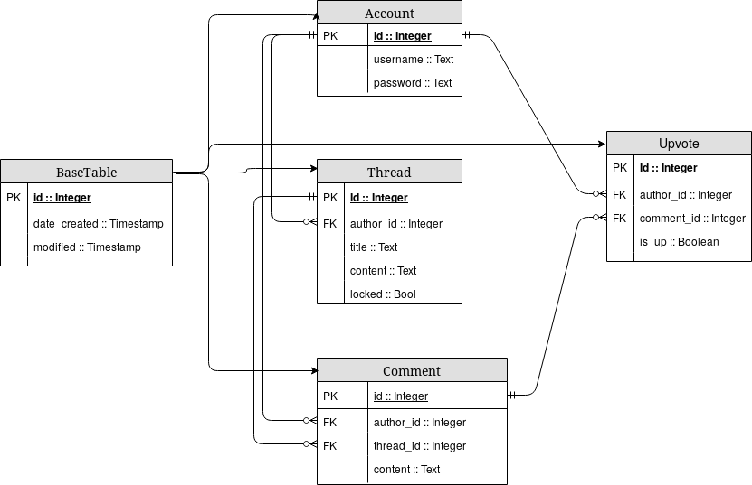

## Tietokantakaavio & CREATE TABLE lauseet

Tietokannassa on 4 taulua.

### account

```
CREATE TABLE account (
        id INTEGER NOT NULL,
        date_created DATETIME,
        date_modified DATETIME,
        username VARCHAR(144) NOT NULL,
        password VARCHAR(144) NOT NULL,
        PRIMARY KEY (id)
);
```

### thread

```
CREATE TABLE thread (
        id INTEGER NOT NULL,
        date_created DATETIME,
        date_modified DATETIME,
        title VARCHAR(144) NOT NULL,
        locked BOOLEAN NOT NULL,
        content TEXT NOT NULL,
        author_id INTEGER NOT NULL,
        PRIMARY KEY (id),
        CHECK (locked IN (0, 1)),
        FOREIGN KEY(author_id) REFERENCES account (id)
);
```

### comment

```
CREATE TABLE comment (
        id INTEGER NOT NULL,
        date_created DATETIME,
        date_modified DATETIME,
        author_id INTEGER NOT NULL,
        thread_id INTEGER NOT NULL,
        content TEXT NOT NULL,
        PRIMARY KEY (id),
        FOREIGN KEY(author_id) REFERENCES account (id),
        FOREIGN KEY(thread_id) REFERENCES thread (id)
);
```

### upvote

```
CREATE TABLE upvote (
        id INTEGER NOT NULL,
        date_created DATETIME,
        date_modified DATETIME,
        comment_id INTEGER NOT NULL,
        author_id INTEGER NOT NULL,
        is_up BOOLEAN NOT NULL,
        PRIMARY KEY (id),
        FOREIGN KEY(comment_id) REFERENCES comment (id),
        FOREIGN KEY(author_id) REFERENCES account (id),
        CHECK (is_up IN (0, 1))
);
```


## Tietokantakaavio


